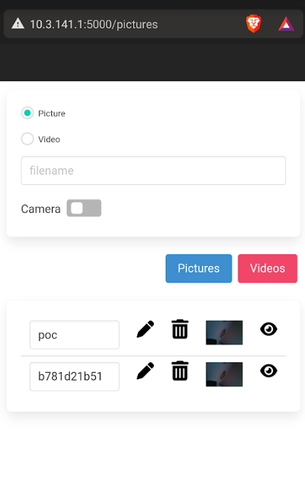

Horus let you transform your raspberry pi 0 (raspiOS buster lite) in an spy camera that can be concealed inside a purse or a handbag. 

It could be usefull during a red team engagement when you need to take pictures:

* of you tailgating someone to penetrate a building

* of you pluging malicious usb key on unlocked workstations

* of you climbing a fence or a wall

* of confidential documents

You don't have to use your phone anymore in a suspicious way, just start the app once to record everything or take a picture.

To install, execute the install.sh script

```
sudo bash install.sh
```

Now you should have the application running as a horus service.

Then you'd like to configure your raspberry pi to work as an access point to connect to it during your engagement. I used the __raspap__ tool to do that (https://github.com/RaspAP/raspap-webgui)

```
curl -sL https://install.raspap.com | bash
```

(Don't forget to set the "WLAN country" option using __sudo raspi-config__)

